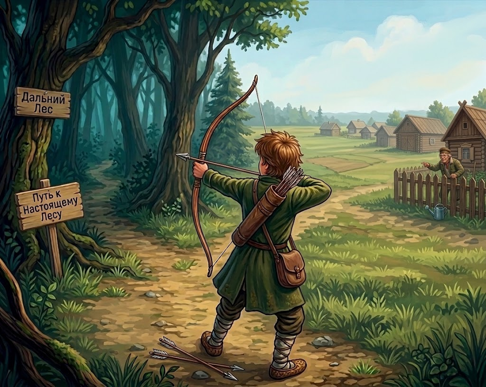

# Сайт Антона

~~Hello World!~~ Так, стоп! Хватит с нас этой избитой фразы :) 

Меня зовут Антон, и я изучаю программирование.

Один из моих основных проектов, над которым я сейчас веду работу, это [текстовая игра про Ивана](https://github.com/Verimar120712/The-adventures-of-Ivan)

## Описание проекта

Игра находится в процессе разработки, пользователю предоставится возможность в месте с героем русских народных сказок пройти приключение через дремучий лес в поисках ранее запущенной стрелы.

Что ждет нашего героя, зависит от выбора пользователя.

В настоящий момент реализована только 1 ветка, и то не до конца, но в планах сделать хотябы 3 и со временем их количество расширять.

